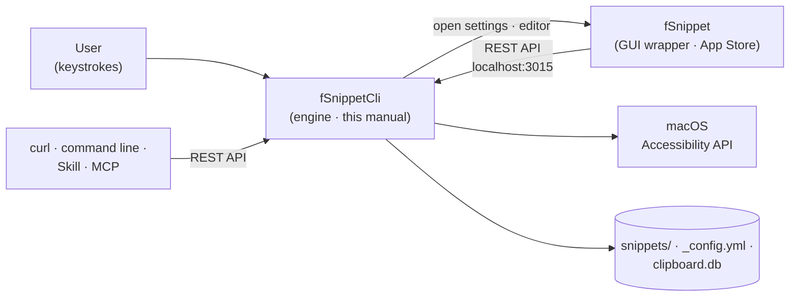

# What is fSnippetCli?

fSnippetCli is a **snippet expansion engine** for macOS: type a short **abbreviation** and it is replaced with a longer text you saved in advance. It lives in the menu bar, watches your keystrokes to expand snippets, and also provides a snippet popup, clipboard history, a REST API, and a command line. It is a free, open-source (Apache-2.0) app distributed through Homebrew.

Snippets are plain text files in folders (`keyword===name.txt`), so you can manage them with Finder, any text editor, or Git.

# fSnippetCli and fSnippet (GUI wrapper)

> **fSnippet (a paid App Store app) is a GUI wrapper for fSnippetCli.**
> fSnippet never handles keystrokes itself. Everything you change in its settings window or snippet editor is saved through the fSnippetCli REST API (`localhost:3015`). So fSnippet cannot run without fSnippetCli, while fSnippetCli provides every core feature on its own.

| Item      | fSnippetCli (this manual)                                                                              | fSnippet                                                                  |
| :-------- | :----------------------------------------------------------------------------------------------------- | :------------------------------------------------------------------------ |
| Role      | Engine (menu bar daemon)                                                                               | GUI wrapper                                                               |
| Delivery  | Homebrew `finfra/tap/fsnippet-cli` (free, open source)                                                 | Mac App Store (paid)                                                      |
| Bundle ID | `kr.finfra.fSnippetCli`                                                                                | `kr.finfra.fSnippet`                                                      |
| UI        | Menu bar icon and menu · snippet popup · clipboard history window                                      | Settings window · snippet editor                                          |
| Features  | Snippet expansion · popup · placeholders · clipboard history · REST API · command line · Alfred import | Editing settings in a GUI · writing and editing snippets                  |
| Manual    | This document                                                                                          | [fSnippet product page](https://finfra.kr/product/fSnippet/en/index.html) |

The following menu item and keys open fSnippet, so they need fSnippet installed. Without it, an App Store prompt appears.

* Menu bar **🔧 Open Settings Window** (default ⌃⇧⌘;)
* **Tab** in the snippet popup — create a new snippet or edit the selected one
* **⌘S** in clipboard history — register a text item as a new snippet

# Key Features

| Feature              | Description                                                                                                 |
| :------------------- | :---------------------------------------------------------------------------------------------------------- |
| Snippet expansion    | Type an abbreviation and press the trigger key (default **right ⌘**) to insert the full text                |
| Folder rules         | Automatic prefix from a folder's capital letters (`Docker` → `d`) · per-folder Prefix/Suffix in `_rule.yml` |
| Snippet popup        | Search and insert snippets from a popup opened by a global hotkey (default ⌥⇧Space)                         |
| Dynamic placeholders | `{{date}}` · `{{clipboard}}` · `{{cursor}}` · input fields and more                                         |
| Clipboard history    | Records text, images and file lists; paste them again with a global hotkey (default ⌘;)                     |
| Alfred import        | Converts an Alfred snippet database (`snippets.alfdb`) into folders and rules                               |
| REST API             | `localhost:3015/api/v2` — for curl, scripts, and AI tools                                                   |
| Command line         | Query the running engine, e.g. `fSnippetCli snippet search …`                                               |
| Claude Code Skill    | Search, expand, and manage snippets in natural language from an AI agent                                    |
| MCP server           | Call fSnippetCli as tools from Claude Desktop and other MCP clients (`fsnippet-mcp`)                        |

# Ways to Use It

1. **Typing** — abbreviation + trigger key ([Snippet Usage](04_Snippet_Usage.md))
2. **Popup and clipboard window** — [Snippet Popup](04_Snippet_Usage.md#snippet-popup) · [Clipboard History](05_Clipboard_Usage.md)
3. **Menu bar, config file, command line** — [Menu Bar Usage](06_MenuBar_Usage.md)
4. **REST API** — [REST API Usage](07_API_Usage.md)
5. **AI integration** — [Claude Code Skill](08_Skill_Usage.md) · [MCP Server](09_MCP_Usage.md)

If you would rather change settings in a window or write snippets in an editor, install the fSnippet wrapper app as well — [fSnippet product page](https://finfra.kr/product/fSnippet/en/index.html).

# Data Location

All data lives under the data folder `~/Documents/finfra/fSnippetData/`. The folder and a default config file are created on first launch.

| Item                 | Path                                                     |
| :------------------- | :------------------------------------------------------- |
| Config file          | `~/Documents/finfra/fSnippetData/_config.yml`            |
| Snippet folder       | `~/Documents/finfra/fSnippetData/snippets/`              |
| Folder rules         | `~/Documents/finfra/fSnippetData/snippets/_rule.yml`     |
| Clipboard history DB | `~/Documents/finfra/fSnippetData/clipboard/clipboard.db` |
| Log                  | `~/Documents/finfra/fSnippetData/logs/flog_cliApp.log`   |

* Open it directly from the menu bar: **⚙️ Configuration ▸ Open Data Folder**
* Set the `fSnippetCli_config` environment variable to use a different data folder

# Next Steps

* [Installation and Permissions](02_Install.md)
* [Quick Start](03_QuickStart.md)
