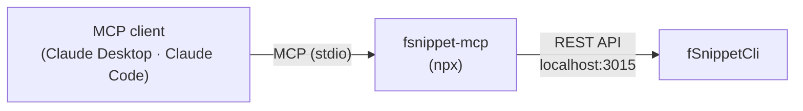

# MCP Server Usage

**fsnippet-mcp** wraps the fSnippetCli [REST API](07_API_Usage.md) as MCP (Model Context Protocol) tools. MCP clients such as Claude Desktop and Claude Code can then call snippet search, expansion and clipboard history lookups as tools. The source is in [mcp/](../../mcp/) in this repository (MIT).



## Prerequisites

* Node.js 18 or later
* fSnippetCli must be running with the REST API on — `curl -s http://localhost:3015/api/v2/status`

## Setup

### Claude Code

Register it with a command (drop `--scope user` to register it for the current project only).

```bash
claude mcp add --scope user fsnippet -- npx -y fsnippet-mcp
```

To share it with a project, put the same entry in `.mcp.json` at the project root.

```json
{
  "mcpServers": {
    "fsnippet": {
      "command": "npx",
      "args": ["-y", "fsnippet-mcp"]
    }
  }
}
```

### Claude Desktop

Put the same JSON in `~/Library/Application Support/Claude/claude_desktop_config.json` and restart Claude Desktop.

### Another Address or Port

The server address is resolved in this order.

| Priority | How                           | Example                                                            |
| :------- | :---------------------------- | :----------------------------------------------------------------- |
| 1        | Argument `--server=<url>`     | `"args": ["-y", "fsnippet-mcp", "--server=http://localhost:4015"]` |
| 2        | Environment `FSNIPPET_SERVER` | `"env": {"FSNIPPET_SERVER": "http://localhost:4015"}`              |
| 3        | Default                       | `http://localhost:3015`                                            |

## Tools

| Tool                | Description                                                               |
| :------------------ | :------------------------------------------------------------------------ |
| `health_check`      | Check server status                                                       |
| `search_snippets`   | Search snippets (`query`, `limit`, `folder`, `offset`)                    |
| `get_snippet`       | Get one snippet (`abbreviation` or `id`)                                  |
| `expand_snippet`    | Expanded text for an abbreviation (placeholder values can be passed)      |
| `clipboard_history` | Clipboard history (`limit` default 50, `kind`, `app`, `pinned`, `offset`) |
| `clipboard_search`  | Search clipboard history                                                  |
| `list_folders`      | List folders · details of one folder (`name`, `limit`, `offset`)          |
| `get_stats`         | Usage stats (`top` · `history`)                                           |
| `get_triggers`      | Trigger keys                                                              |

The MCP tools focus on lookup and expansion. To create or delete snippets or change settings, use the [REST API](07_API_Usage.md) or the [Claude Code Skill](08_Skill_Usage.md).

## Verification and Troubleshooting

```bash
# See the tool list and call results in MCP Inspector
npx @modelcontextprotocol/inspector npx fsnippet-mcp
```

| Symptom                           | Check                                                                          |
| :-------------------------------- | :----------------------------------------------------------------------------- |
| Tool calls fail to connect        | fSnippetCli running and REST on (`brew services info fsnippet-cli`)            |
| `503` responses                   | Menu bar **👻 Daemon ▸ Resume REST API**                                       |
| Tools don't show up in the client | Check the JSON syntax and restart the client · `node --version` is 18 or later |

## Next Steps

* [FAQ](10_FAQ.md)
