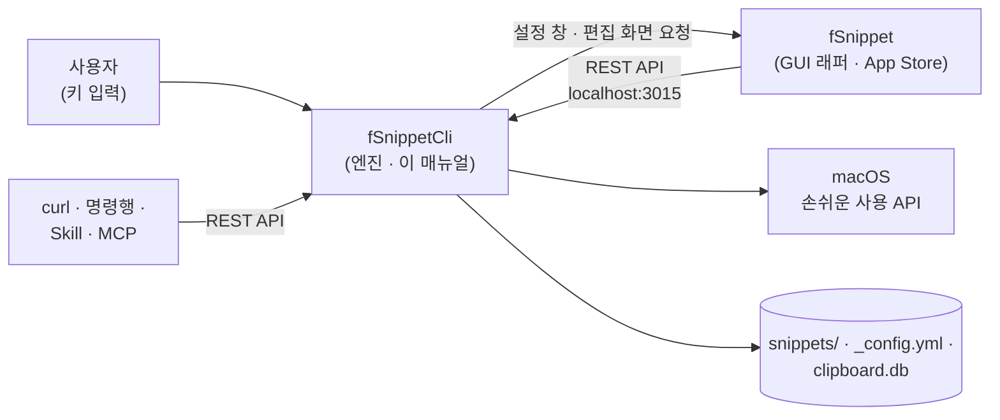

# fSnippetCli 란?

fSnippetCli 는 macOS 에서 짧은 **약어(Abbreviation)** 를 입력하면 미리 저장한 긴 텍스트로 바꿔 주는 **스니펫 확장 엔진**입니다. 메뉴바에 상주하며 키 입력을 감시해 스니펫을 확장하고, 스니펫 팝업 · 클립보드 히스토리 · REST API · 명령행을 함께 제공합니다. Homebrew 로 배포되는 무료 · 오픈소스(Apache-2.0) 앱입니다.

스니펫은 폴더 안의 평범한 텍스트 파일(`keyword===name.txt`)이라 Finder · 편집기 · Git 으로 그대로 관리할 수 있습니다.

# fSnippetCli 와 fSnippet (GUI 래퍼)

> **fSnippet(App Store 유료 앱)은 fSnippetCli 의 GUI 래퍼입니다.**
> fSnippet 은 키 입력을 직접 다루지 않고, 설정 창 · 스니펫 편집 화면에서 바꾼 값을 모두 fSnippetCli 의 REST API(`localhost:3015`)로 저장합니다. 그래서 fSnippet 은 fSnippetCli 없이는 동작하지 않고, fSnippetCli 는 fSnippet 없이도 모든 핵심 기능이 동작합니다.

| 구분      | fSnippetCli (이 매뉴얼)                                                                     | fSnippet                                                                 |
| :-------- | :------------------------------------------------------------------------------------------ | :----------------------------------------------------------------------- |
| 역할      | 엔진(메뉴바 상주 데몬)                                                                      | GUI 래퍼                                                                 |
| 배포      | Homebrew `finfra/tap/fsnippet-cli` (무료 · 오픈소스)                                        | Mac App Store (유료)                                                     |
| Bundle ID | `kr.finfra.fSnippetCli`                                                                     | `kr.finfra.fSnippet`                                                     |
| 화면      | 메뉴바 아이콘과 메뉴 · 스니펫 팝업 · 클립보드 히스토리 창                                   | 설정 창 · 스니펫 편집기                                                  |
| 기능      | 스니펫 확장 · 팝업 · 플레이스홀더 · 클립보드 히스토리 · REST API · 명령행 · Alfred 가져오기 | 설정 GUI 편집 · 새 스니펫 작성 · 스니펫 수정                             |
| 매뉴얼    | 이 문서                                                                                     | [fSnippet 제품 페이지](https://finfra.kr/product/fSnippet/kr/index.html) |

다음 메뉴 · 키는 fSnippet 을 여는 동작이라 fSnippet 이 있어야 합니다. 없으면 App Store 안내 창이 나타납니다.

* 메뉴바 **🔧 설정 창 열기** (기본 ⌃⇧⌘;)
* 스니펫 팝업의 **Tab** — 새 스니펫 작성 · 선택한 스니펫 수정
* 클립보드 히스토리의 **⌘S** — 텍스트 항목을 새 스니펫으로 등록

# 핵심 기능

| 기능              | 설명                                                                                     |
| :---------------- | :--------------------------------------------------------------------------------------- |
| 스니펫 확장       | 약어를 입력하고 트리거 키(기본 **오른쪽 ⌘**)를 누르면 전체 텍스트로 바뀜                 |
| 폴더 규칙         | 폴더명의 대문자로 접두어 자동 생성(`Docker` → `d`) · `_rule.yml` 로 폴더별 Prefix/Suffix |
| 스니펫 팝업       | 전역 단축키(기본 ⌥⇧Space)로 검색 창을 띄워 골라 넣기                                     |
| 동적 플레이스홀더 | `{{date}}` · `{{clipboard}}` · `{{cursor}}` · 입력 폼 등                                 |
| 클립보드 히스토리 | 텍스트 · 이미지 · 파일 목록을 기록하고 전역 단축키(기본 ⌘;)로 다시 붙여넣기              |
| Alfred 가져오기   | Alfred 스니펫 DB(`snippets.alfdb`)를 폴더 · 규칙으로 변환                                |
| REST API          | `localhost:3015/api/v2` — curl · 스크립트 · AI 도구 연동                                 |
| 명령행            | `fSnippetCli snippet search …` 처럼 실행 중인 엔진에 질의                                |
| Claude Code Skill | AI 에이전트에서 자연어로 스니펫 검색 · 확장 · 관리                                       |
| MCP 서버          | Claude Desktop 등 AI 도구에서 도구(Tool)로 호출 (`fsnippet-mcp`)                         |

# 사용 방법

1. **타이핑** — 약어 + 트리거 키 ([스니펫 사용법](04_Snippet_Usage.md))
2. **팝업 · 클립보드 창** — [스니펫 팝업](04_Snippet_Usage.md#스니펫-팝업) · [클립보드 히스토리](05_Clipboard_Usage.md)
3. **메뉴바 · 설정 파일 · 명령행** — [메뉴바 사용법](06_MenuBar_Usage.md)
4. **REST API** — [REST API 사용법](07_API_Usage.md)
5. **AI 연동** — [Claude Code Skill](08_Skill_Usage.md) · [MCP 서버](09_MCP_Usage.md)

설정을 GUI 로 바꾸거나 스니펫을 편집 화면에서 쓰고 싶으면 래퍼 앱 fSnippet 을 함께 설치합니다 — [fSnippet 제품 페이지](https://finfra.kr/product/fSnippet/kr/index.html).

# 데이터 위치

모든 데이터는 데이터 폴더 `~/Documents/finfra/fSnippetData/` 아래에 있습니다. 첫 실행 때 폴더와 기본 설정 파일이 만들어집니다.

| 항목                 | 경로                                                     |
| :------------------- | :------------------------------------------------------- |
| 설정 파일            | `~/Documents/finfra/fSnippetData/_config.yml`            |
| 스니펫 폴더          | `~/Documents/finfra/fSnippetData/snippets/`              |
| 폴더 규칙            | `~/Documents/finfra/fSnippetData/snippets/_rule.yml`     |
| 클립보드 히스토리 DB | `~/Documents/finfra/fSnippetData/clipboard/clipboard.db` |
| 로그                 | `~/Documents/finfra/fSnippetData/logs/flog_cliApp.log`   |

* 메뉴바 **⚙️ 환경 설정 ▸ 데이터 폴더 열기** 로 바로 열 수 있습니다
* 환경변수 `fSnippetCli_config` 에 경로를 주면 다른 데이터 폴더를 씁니다

# 다음 단계

* [설치 및 권한 설정](02_Install.md)
* [빠른 시작](03_QuickStart.md)
