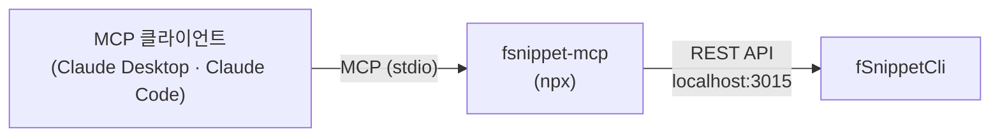

# MCP 서버 사용법

**fsnippet-mcp** 는 fSnippetCli 의 [REST API](07_API_Usage.md)를 MCP(Model Context Protocol) 도구로 감싼 서버입니다. Claude Desktop · Claude Code 같은 MCP 클라이언트가 스니펫 검색 · 확장, 클립보드 히스토리 조회를 도구로 호출할 수 있습니다. 소스는 이 저장소의 [mcp/](../../mcp/) 에 있습니다(MIT).



## 전제

* Node.js 18 이상
* fSnippetCli 가 실행 중이고 REST API 가 켜져 있어야 합니다 — `curl -s http://localhost:3015/api/v2/status`

## 설정

### Claude Code

명령으로 등록합니다(`--scope user` 를 빼면 현재 프로젝트에만 등록).

```bash
claude mcp add --scope user fsnippet -- npx -y fsnippet-mcp
```

프로젝트 단위로 공유하려면 프로젝트 루트의 `.mcp.json` 에 같은 내용을 적습니다.

```json
{
  "mcpServers": {
    "fsnippet": {
      "command": "npx",
      "args": ["-y", "fsnippet-mcp"]
    }
  }
}
```

### Claude Desktop

`~/Library/Application Support/Claude/claude_desktop_config.json` 에 같은 내용을 넣고 Claude Desktop 을 다시 실행합니다.

### 다른 주소 · 포트

서버 주소는 다음 순서로 정해집니다.

| 순위 | 방법                       | 예                                                                 |
| :--- | :------------------------- | :----------------------------------------------------------------- |
| 1    | 인자 `--server=<url>`      | `"args": ["-y", "fsnippet-mcp", "--server=http://localhost:4015"]` |
| 2    | 환경변수 `FSNIPPET_SERVER` | `"env": {"FSNIPPET_SERVER": "http://localhost:4015"}`              |
| 3    | 기본값                     | `http://localhost:3015`                                            |

## 도구

| 도구                | 설명                                                               |
| :------------------ | :----------------------------------------------------------------- |
| `health_check`      | 서버 상태 확인                                                     |
| `search_snippets`   | 스니펫 검색 (`query`, `limit`, `folder`, `offset`)                 |
| `get_snippet`       | 스니펫 하나 조회 (`abbreviation` 또는 `id`)                        |
| `expand_snippet`    | 약어 확장 결과 텍스트 (플레이스홀더 값 전달 가능)                  |
| `clipboard_history` | 클립보드 기록 (`limit` 기본 50, `kind`, `app`, `pinned`, `offset`) |
| `clipboard_search`  | 클립보드 기록 검색                                                 |
| `list_folders`      | 폴더 목록 · 폴더 하나 상세 (`name`, `limit`, `offset`)             |
| `get_stats`         | 사용 통계 (`top` · `history`)                                      |
| `get_triggers`      | 트리거 키                                                          |

MCP 도구는 조회 · 확장 중심입니다. 스니펫을 만들거나 지우거나 설정을 바꾸려면 [REST API](07_API_Usage.md) 나 [Claude Code Skill](08_Skill_Usage.md)을 씁니다.

## 확인 · 문제 해결

```bash
# MCP Inspector 로 도구 목록과 호출 결과 보기
npx @modelcontextprotocol/inspector npx fsnippet-mcp
```

| 증상                        | 확인                                                                       |
| :-------------------------- | :------------------------------------------------------------------------- |
| 도구 호출이 연결 오류       | fSnippetCli 실행 · REST 켜짐 확인 (`brew services info fsnippet-cli`)      |
| `503` 응답                  | 메뉴바 **👻 데몬 ▸ REST API 재개**                                         |
| 클라이언트에 도구가 안 보임 | 설정 JSON 문법 확인 후 클라이언트 재시작 · `node --version` 이 18 이상인지 |

## 다음 단계

* [자주 묻는 질문](10_FAQ.md)
